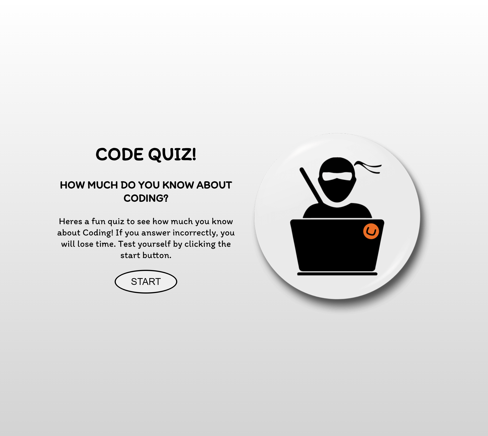

# Code Quiz

### Description

This file includes a link and screenshot showing the file named Quiz-time.There are a total of 8 multiple-choice questions in this JavaScript Code Quiz challenge. After finishing, you'll be given a score. Your score will be added to a Highscore record once you submit your initial. You may keep track of your individual scores on the Highscore board.

#### Here are some of the things included in this file:

- 10 different multiple choice questions
- Timer-set time limit
- Shows whether answer is correct or incorrect
- Saves your initials and score to local storage
- Highscore record page
- Responsive layout

### Link

https://aisha1710.github.io/Quiz-time/

### Screenshot of my code quiz page

